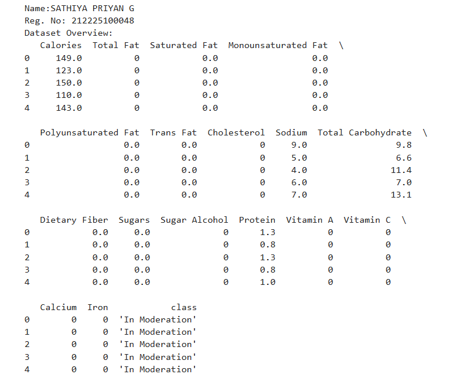
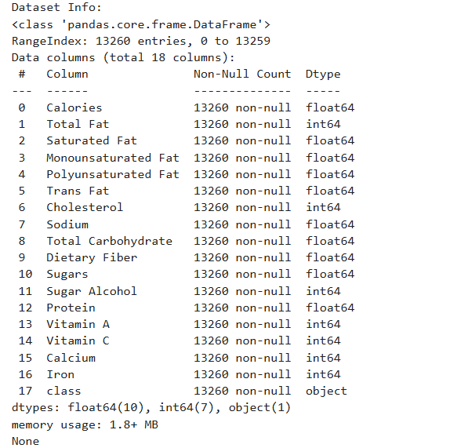
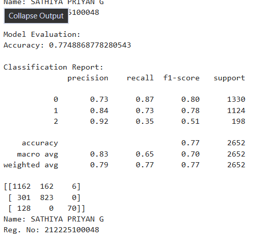
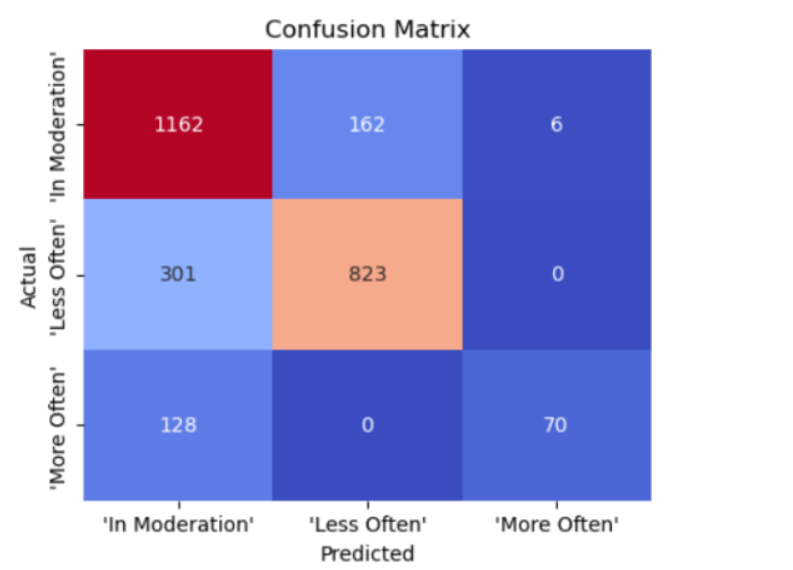

# BLENDED_LEARNING
# Implementation of Logistic Regression Model for Classifying Food Choices for Diabetic Patients

## AIM:
To implement a logistic regression model to classify food items for diabetic patients based on nutrition information.

## Equipments Required:
1. Hardware – PCs
2. Anaconda – Python 3.7 Installation / Jupyter notebook

## Algorithm
1. Import necessary libraries.
2. Load the dataset using pd.read_csv().
3. Display data types, basic statistics, and class distributions.
4. Visualize class distributions with a bar plot.
5. Scale feature columns using MinMaxScaler.
6. Encode target labels with LabelEncoder.
7. Split data into training and testing sets with train_test_split().
8. Train LogisticRegression with specified hyperparameters and evaluate the model using metrics and a confusion matrix plot.  


## Program:
```
/*
Program to implement Logistic Regression for classifying food choices based on nutritional information.
Developed by: SATHIYA PRIYAN G
RegisterNumber:  212225100048
*/
```
```
import pandas as pd
from sklearn.model_selection import train_test_split
from sklearn.linear_model import LogisticRegression
from sklearn.preprocessing import LabelEncoder, MinMaxScaler
from sklearn.metrics import accuracy_score, precision_score, recall_score, f1_score, confusion_matrix, classification_report
import seaborn as sns
import matplotlib.pyplot as plt

df=pd.read_csv('food_items (1).csv')
print('Name:SATHIYA PRIYAN G')
print('Reg. No: 212225100048')
print("Dataset Overview:")
print(df.head())
print("\nDataset Info:")
print(df.info())
X_raw = df.iloc[:,:-1]
y_raw = df.iloc[:,-1:]
scaler= MinMaxScaler()
X= scaler.fit_transform(X_raw)
label_encoder = LabelEncoder()
y= label_encoder.fit_transform(y_raw.values.ravel())


X_train, X_test, y_train, y_test = train_test_split(X, y, test_size=0.2, stratify =y, random_state=123)

penalty='l2'

multi_class='multinomial'

solver= 'lbfgs'

max_iter=1000
l2_model = LogisticRegression(
    random_state=123,
    penalty=penalty,
    multi_class=multi_class, 
    solver=solver, 
    max_iter=max_iter
)
l2_model.fit(X_train, y_train)

y_pred= l2_model.predict(X_test)
print('Name: SATHIYA PRIYAN G')
print('Reg. No: 212225100048')
print("\nModel Evaluation:")
print("Accuracy:",accuracy_score(y_test, y_pred))
print("\nClassification Report:")
print(classification_report(y_test, y_pred))

conf_matrix= confusion_matrix(y_test, y_pred)
print(conf_matrix)

print('Name: SATHIYA PRIYAN G')
print('Reg. No: 212225100048')
```
## Output:




## Result:
Thus, the logistic regression model was successfully implemented to classify food items for diabetic patients based on nutritional information, and the model's performance was evaluated using various performance metrics such as accuracy, precision, and recall.
